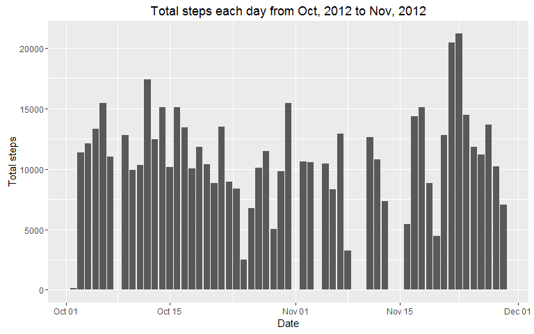
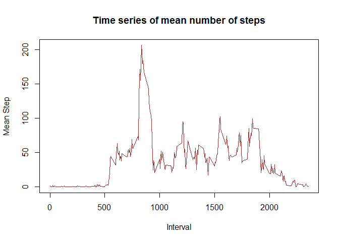
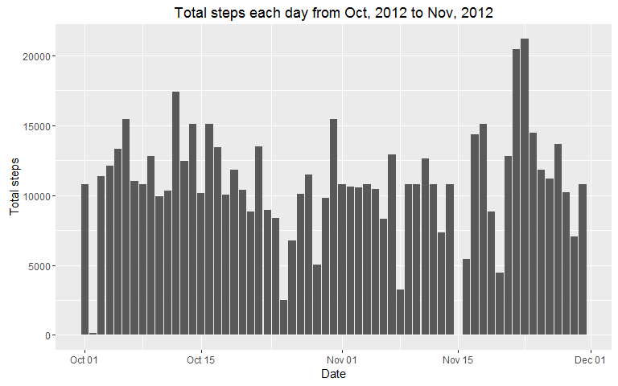
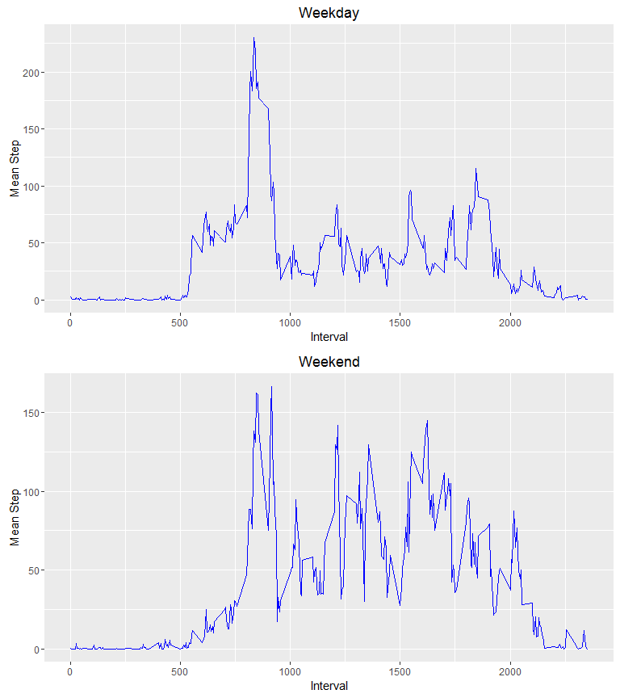

Load packages
-------------

Loading the required packages:

      library(ggplot2)
      library(lubridate) 
      library(dplyr)
      library(gridExtra)

Reading the file and understanding it
-------------------------------------

      activity <- read.csv("activity.csv")

      str(activity)

    ## 'data.frame':    17568 obs. of  3 variables:
    ##  $ steps   : int  NA NA NA NA NA NA NA NA NA NA ...
    ##  $ date    : Factor w/ 61 levels "2012-10-01","2012-10-02",..: 1 1 1 1 1 1 1 1 1 1 ...
    ##  $ interval: int  0 5 10 15 20 25 30 35 40 45 ...

      sum(is.na(activity$steps))

    ## [1] 2304

As described in introduction, the dataset consists of 3 columns viz. :

-   Date : The date of the experiment
-   Interval : The 5 minute interval's starting point
-   Steps : Number of steps taken in that interval

Also, we see that there are 2304 NA values and the date column is also a
factor. So, we need to do something about the NA values and convert
factors into proper date formats. However, this will be done later as we
progress through all the questions

What is mean total number of steps taken per day?
-------------------------------------------------

      ## Subsetting the non-NA values
      activity_new <- activity[!is.na(activity$steps),]

      ## Converting date into characters to group them
      activity_new$date <- as.character(activity_new$date)

      ## Finding mean, median and total steps of each day
      summary_new <- summarise(group_by(activity_new,date), Mean_steps =mean(steps),  Median_steps=median(steps), Sum=sum(steps))

      summary_frame <- as.data.frame(summary_new)

      print(summary_frame)

    ##          date Mean_steps Median_steps   Sum
    ## 1  2012-10-02  0.4375000            0   126
    ## 2  2012-10-03 39.4166667            0 11352
    ## 3  2012-10-04 42.0694444            0 12116
    ## 4  2012-10-05 46.1597222            0 13294
    ## 5  2012-10-06 53.5416667            0 15420
    ## 6  2012-10-07 38.2465278            0 11015
    ## 7  2012-10-09 44.4826389            0 12811
    ## 8  2012-10-10 34.3750000            0  9900
    ## 9  2012-10-11 35.7777778            0 10304
    ## 10 2012-10-12 60.3541667            0 17382
    ## 11 2012-10-13 43.1458333            0 12426
    ## 12 2012-10-14 52.4236111            0 15098
    ## 13 2012-10-15 35.2048611            0 10139
    ## 14 2012-10-16 52.3750000            0 15084
    ## 15 2012-10-17 46.7083333            0 13452
    ## 16 2012-10-18 34.9166667            0 10056
    ## 17 2012-10-19 41.0729167            0 11829
    ## 18 2012-10-20 36.0937500            0 10395
    ## 19 2012-10-21 30.6284722            0  8821
    ## 20 2012-10-22 46.7361111            0 13460
    ## 21 2012-10-23 30.9652778            0  8918
    ## 22 2012-10-24 29.0104167            0  8355
    ## 23 2012-10-25  8.6527778            0  2492
    ## 24 2012-10-26 23.5347222            0  6778
    ## 25 2012-10-27 35.1354167            0 10119
    ## 26 2012-10-28 39.7847222            0 11458
    ## 27 2012-10-29 17.4236111            0  5018
    ## 28 2012-10-30 34.0937500            0  9819
    ## 29 2012-10-31 53.5208333            0 15414
    ## 30 2012-11-02 36.8055556            0 10600
    ## 31 2012-11-03 36.7048611            0 10571
    ## 32 2012-11-05 36.2465278            0 10439
    ## 33 2012-11-06 28.9375000            0  8334
    ## 34 2012-11-07 44.7326389            0 12883
    ## 35 2012-11-08 11.1770833            0  3219
    ## 36 2012-11-11 43.7777778            0 12608
    ## 37 2012-11-12 37.3784722            0 10765
    ## 38 2012-11-13 25.4722222            0  7336
    ## 39 2012-11-15  0.1423611            0    41
    ## 40 2012-11-16 18.8923611            0  5441
    ## 41 2012-11-17 49.7881944            0 14339
    ## 42 2012-11-18 52.4652778            0 15110
    ## 43 2012-11-19 30.6979167            0  8841
    ## 44 2012-11-20 15.5277778            0  4472
    ## 45 2012-11-21 44.3993056            0 12787
    ## 46 2012-11-22 70.9270833            0 20427
    ## 47 2012-11-23 73.5902778            0 21194
    ## 48 2012-11-24 50.2708333            0 14478
    ## 49 2012-11-25 41.0902778            0 11834
    ## 50 2012-11-26 38.7569444            0 11162
    ## 51 2012-11-27 47.3819444            0 13646
    ## 52 2012-11-28 35.3576389            0 10183
    ## 53 2012-11-29 24.4687500            0  7047

      ## Converting them back to date format for plotting purpose
      summary_frame$date <- as.POSIXct(summary_frame$date)
       
      ggplot(data=summary_frame, aes(date,Sum)) + geom_bar(stat = "identity") + xlab("Date") + ylab("Total steps") + ggtitle("Total steps each day from Oct, 2012 to Nov, 2012")

What is the average daily activity pattern?
-------------------------------------------

     ## Summarising by each 5 minute interval
     summary_time <- summarise(group_by(activity_new,interval),Mean_step=mean(steps))

     summary_time <- as.data.frame(summary_time)

     plot(summary_time$interval,summary_time$Mean_step,type = "l",col="brown",lwd=1.5, xlab = "Interval",ylab =   "Mean Step", main = "Time series of mean number of steps")

### Finding the interval with the maximum number of average steps

    summary_time[summary_time$Mean_step==max(summary_time$Mean_step),]

    ##     interval Mean_step
    ## 104      835  206.1698

The maximum number of average steps is 206.17 from time 08:35 AM to
08:40 AM.

Inputting Missing Values
------------------------

Here, the NA value for each interval 0,5,10 etc will be replaced by the
mean value of steps taken by the human over the entire period of test in
that particular interval.

    interval_times <- unique(activity$interval)

    n <- length(interval_times)

      for( i in 1 : n)
      {
        interval_data <- activity[activity$interval==interval_times[i],]
        
        mean_steps <- mean(interval_data$steps, na.rm=T)
        
        activity [activity$interval==interval_times[i] & is.na(activity$steps), "steps" ] <- mean_steps
      }

    activity$steps <- round(activity$steps,3)

Finding sum, mean, median number of steps for each day with new values
----------------------------------------------------------------------

      activity$date <- as.character(activity$date)

      ## Finding mean, median and total steps of each day with all values
      summary <- summarise(group_by(activity,date), Mean_steps =mean(steps), Median_steps=median(steps),   Sum=sum(steps))

      summary <- as.data.frame(summary)
     
      print(summary)

    ##          date Mean_steps Median_steps      Sum
    ## 1  2012-10-01 37.3825903       34.113 10766.19
    ## 2  2012-10-02  0.4375000        0.000   126.00
    ## 3  2012-10-03 39.4166667        0.000 11352.00
    ## 4  2012-10-04 42.0694444        0.000 12116.00
    ## 5  2012-10-05 46.1597222        0.000 13294.00
    ## 6  2012-10-06 53.5416667        0.000 15420.00
    ## 7  2012-10-07 38.2465278        0.000 11015.00
    ## 8  2012-10-08 37.3825903       34.113 10766.19
    ## 9  2012-10-09 44.4826389        0.000 12811.00
    ## 10 2012-10-10 34.3750000        0.000  9900.00
    ## 11 2012-10-11 35.7777778        0.000 10304.00
    ## 12 2012-10-12 60.3541667        0.000 17382.00
    ## 13 2012-10-13 43.1458333        0.000 12426.00
    ## 14 2012-10-14 52.4236111        0.000 15098.00
    ## 15 2012-10-15 35.2048611        0.000 10139.00
    ## 16 2012-10-16 52.3750000        0.000 15084.00
    ## 17 2012-10-17 46.7083333        0.000 13452.00
    ## 18 2012-10-18 34.9166667        0.000 10056.00
    ## 19 2012-10-19 41.0729167        0.000 11829.00
    ## 20 2012-10-20 36.0937500        0.000 10395.00
    ## 21 2012-10-21 30.6284722        0.000  8821.00
    ## 22 2012-10-22 46.7361111        0.000 13460.00
    ## 23 2012-10-23 30.9652778        0.000  8918.00
    ## 24 2012-10-24 29.0104167        0.000  8355.00
    ## 25 2012-10-25  8.6527778        0.000  2492.00
    ## 26 2012-10-26 23.5347222        0.000  6778.00
    ## 27 2012-10-27 35.1354167        0.000 10119.00
    ## 28 2012-10-28 39.7847222        0.000 11458.00
    ## 29 2012-10-29 17.4236111        0.000  5018.00
    ## 30 2012-10-30 34.0937500        0.000  9819.00
    ## 31 2012-10-31 53.5208333        0.000 15414.00
    ## 32 2012-11-01 37.3825903       34.113 10766.19
    ## 33 2012-11-02 36.8055556        0.000 10600.00
    ## 34 2012-11-03 36.7048611        0.000 10571.00
    ## 35 2012-11-04 37.3825903       34.113 10766.19
    ## 36 2012-11-05 36.2465278        0.000 10439.00
    ## 37 2012-11-06 28.9375000        0.000  8334.00
    ## 38 2012-11-07 44.7326389        0.000 12883.00
    ## 39 2012-11-08 11.1770833        0.000  3219.00
    ## 40 2012-11-09 37.3825903       34.113 10766.19
    ## 41 2012-11-10 37.3825903       34.113 10766.19
    ## 42 2012-11-11 43.7777778        0.000 12608.00
    ## 43 2012-11-12 37.3784722        0.000 10765.00
    ## 44 2012-11-13 25.4722222        0.000  7336.00
    ## 45 2012-11-14 37.3825903       34.113 10766.19
    ## 46 2012-11-15  0.1423611        0.000    41.00
    ## 47 2012-11-16 18.8923611        0.000  5441.00
    ## 48 2012-11-17 49.7881944        0.000 14339.00
    ## 49 2012-11-18 52.4652778        0.000 15110.00
    ## 50 2012-11-19 30.6979167        0.000  8841.00
    ## 51 2012-11-20 15.5277778        0.000  4472.00
    ## 52 2012-11-21 44.3993056        0.000 12787.00
    ## 53 2012-11-22 70.9270833        0.000 20427.00
    ## 54 2012-11-23 73.5902778        0.000 21194.00
    ## 55 2012-11-24 50.2708333        0.000 14478.00
    ## 56 2012-11-25 41.0902778        0.000 11834.00
    ## 57 2012-11-26 38.7569444        0.000 11162.00
    ## 58 2012-11-27 47.3819444        0.000 13646.00
    ## 59 2012-11-28 35.3576389        0.000 10183.00
    ## 60 2012-11-29 24.4687500        0.000  7047.00
    ## 61 2012-11-30 37.3825903       34.113 10766.19

      summary$date <- as.POSIXct(summary$date)
       
      ggplot(data=summary, aes(date,Sum)) + geom_bar(stat = "identity") + xlab("Date") + ylab("Total steps") + ggtitle("Total steps each day from Oct, 2012 to Nov, 2012")

Clssifying the dates into weekday or weekend
--------------------------------------------

      activity$date <- as.POSIXlt(activity$date)

      ## 1: Sunday and 7: Saturday
      activity$type <- ifelse( wday(activity$date) == 1 | wday(activity$date) == 7 ,"weekend" ,"weekday")

      activity$type <- as.factor(activity$type)

Are there differences in activity patterns between weekdays and weekends?
-------------------------------------------------------------------------

      activity$date <- as.character(activity$date)

      ## Splitting data into weekend and weekday data
      split_data <- split(activity,activity$type)

      weekday_data <- split_data[[1]]

      weekend_data <- split_data[[2]]

      ## Finding mean steps for each interval on weekdays
      summary_day <- summarise(group_by(weekday_data,interval), Mean_steps =mean(steps))

      summary_day  <- as.data.frame(summary_day)

      ## Finding mean steps for each interval on weekends
      summary_end <- summarise(group_by(weekend_data,interval), Mean_steps =mean(steps))

      summary_end  <- as.data.frame(summary_end)

      g1 <- ggplot(data=summary_day,aes(interval,Mean_steps)) + geom_line(colour="blue") + xlab("Interval") + ylab("Mean Step") + ggtitle("Weekday")

      g2 <- ggplot(data=summary_end,aes(interval,Mean_steps)) + geom_line(colour="blue") + xlab("Interval") + ylab("Mean Step") + ggtitle("Weekend")

      ## Plotting them on the same canvas
      grid.arrange(g1,g2,ncol=1)

